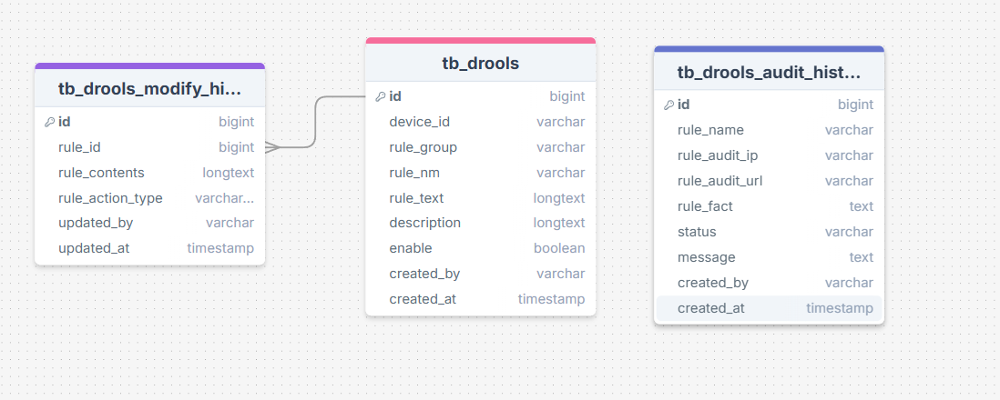
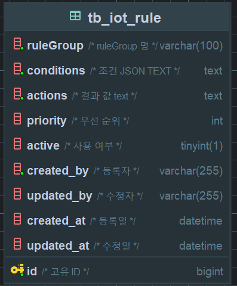
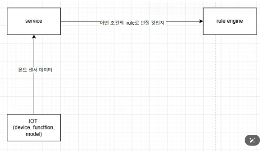
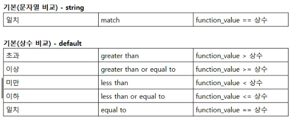

# Drool Engine Project 

## project Spec 
````
 언어  :  kotlin 
 spring boot version :  3.2.5
 DB :  mysql 
 Nosql : redis
 Drool engine version : 8.44.0.Final
   
````

## API test
```
 local :  http://localhost:8020/swagger-ui/index.html
```

## drl 파일 양식 (text 파일)
```
thymeleaf 를 사용하여 template화 
```

## Cash rule 사용 
```
 rule 규칙을 외부 cash 저장소 (redis) 에 저장 후 사용 
```

## DB 테이블 설계 
### Drools를 사용 하는 경우 


### Drools를 사용하지 않는 경우 



## Drools 흐름도 

```
  - 특정 센서 데이터가 들어 오면, 해당 센서 데이터에 맞는 Action을 리턴 
  - (단 중복이 되지 않게) 예시로는 작성한 룰을 다른 이가 변경 했을 시 룰은 업데이터 되어야 한다. 
  -[특이 사항] 삭제를 하더라도 tb_drools_modify_history에는 삭제 내역 까지 남음 
```

## 룰 생성 규칙 



## 배포 
```
 jenkins 
 [DEV] port :  0627  --> 외부 포트 open 희망 
 
```
